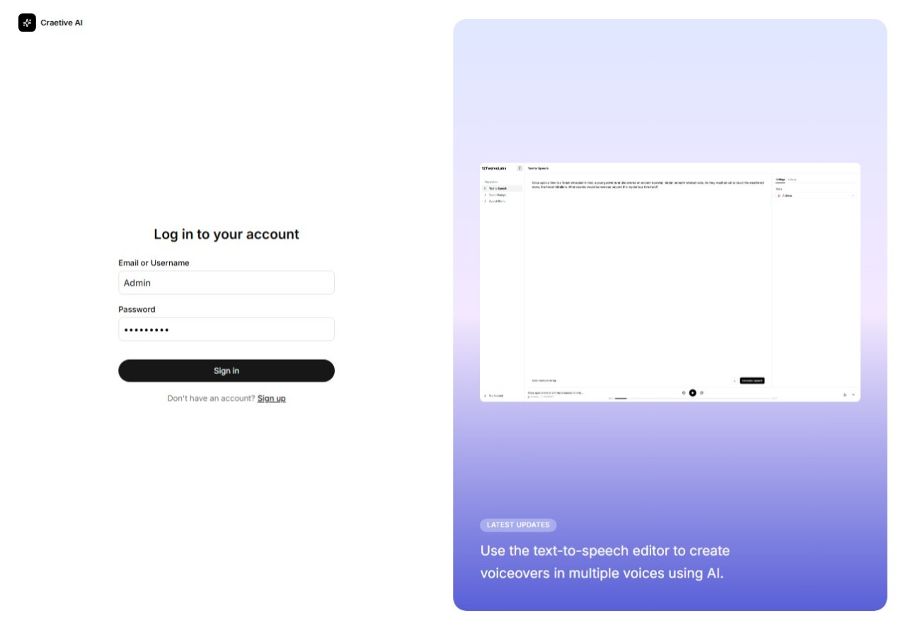
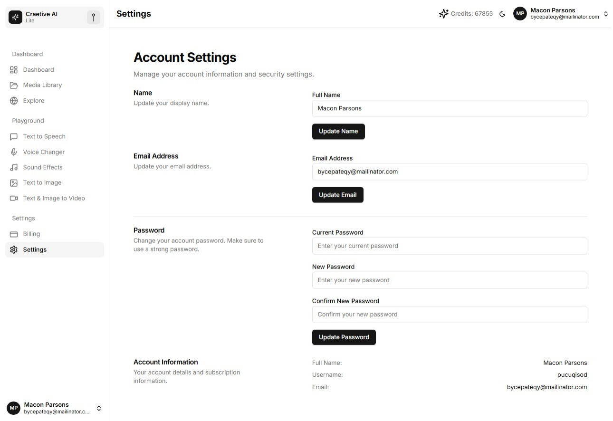

# Creative AI Platform 🎨🤖

A modern AI-powered creative platform built with the T3 Stack that enables users to generate images, videos, speech, and sound effects using cutting-edge AI technologies.

## � Live Demo

🔗 **[View Live Demo](https://creative-ai-ab.vercel.app/)**

**Note**: Currently, only the Admin & Dashboard & Settings feature is fully functional in the live demo. Other AI generation features (text to image, text to speech, voice changer, text to sound effects, and video & image generation) require paid API services and are not active in the demo environment.

## �🎥 Video Preview

<div align="center">
   <a href="https://www.youtube.com/watch?v=nZtE_hA7aMU">
      
   </a>
</div>

_Watch the full demo to see Creative AI Platform in action_

## 📸 Screenshots

### 🏠 Landing Page

<div align="center">
  
  
</div>

### 📊 Dashboard

<div align="center">
  
  
</div>

### 🎨 AI Content Generation

#### Image Generation

<div align="center">
  
</div>

#### Video Generation

<div align="center">
  
  
</div>

#### Speech Synthesis

<div align="center">
  
  
</div>

#### Voice Transformation

<div align="center">
  
  
</div>

#### Sound Effects Generation

<div align="center">
  
  
</div>

### 🗂️ Media Library & Expore Gallery

<div align="center">
  
  
</div>

<div align="center">
  
  
</div>

### 👤 User Management

<div align="center">
  
  
</div>

<div align="center">
  
  
</div>

### 🔧 Admin Dashboard

<div align="center">
  
  
</div>

<div align="center">
  
  
</div>

<div align="center">
  
</div>

### 🛠️ Development & API

<div align="center">
  
  
</div>

<div align="center">
  
  
</div>

## ✨ Features

### 🎨 AI Content Generation

- **Image Generation**: Create stunning images using advanced AI models (Flux, Stability AI)
- **Video Generation**: Generate videos with AI-powered tools
- **Speech Synthesis**: Convert text to natural-sounding speech with custom voices
- **Sound Effects**: Generate custom sound effects for your projects

### 👤 User Management

- **Authentication**: Secure user authentication with NextAuth.js
- **User Profiles**: Personalized user accounts and settings
- **Subscription Management**: Stripe integration for premium features
- **Credit System**: Track and manage user credits for AI generations

### 📱 Modern Interface

- **Responsive Design**: Beautiful, mobile-first design with Tailwind CSS
- **Dark/Light Mode**: Theme switching with next-themes
- **Interactive Components**: Rich UI components with Radix UI
- **Real-time Updates**: Live generation status and progress tracking

### 🔧 Admin Features

- **Admin Dashboard**: Comprehensive admin panel for user and content management
- **Analytics**: Track usage statistics and user engagement
- **Content Moderation**: Review and manage generated content

## 🛠️ Tech Stack

### Frontend

- **Framework**: [Next.js 15](https://nextjs.org) with App Router
- **Styling**: [Tailwind CSS](https://tailwindcss.com) + [Radix UI](https://radix-ui.com)
- **State Management**: [Zustand](https://zustand-js.org)
- **Animations**: [Framer Motion](https://framer.com/motion)
- **Forms**: [React Hook Form](https://react-hook-form.com) + [Zod](https://zod.dev)

### Backend

- **Database**: [Prisma](https://prisma.io) with SQLite
- **Authentication**: [NextAuth.js](https://next-auth.js.org)
- **File Storage**: AWS S3 integration
- **Background Jobs**: [Inngest](https://inngest.com)
- **Payments**: [Stripe](https://stripe.com)

### AI Integration

- **Image Generation**: [fireworks.ai](https://fireworks.ai), Flux, Stability AI, PlayGround
- **Video Generation**: [Fal.ai](https://fal.ai), LTX Video, Kling Video
- **Speech Synthesis**: Custom TTS models
- **Voice Cloning**: SeedVC and StyleTTS2 integration

## 🚀 Getting Started

### Prerequisites

- Node.js 18+
- npm or yarn
- SQLite database

### Installation

1. **Clone the repository**

   ```bash
   git clone <repository-url>
   cd creative-ai
   ```

2. **Install dependencies**

   ```bash
   npm install
   ```

3. **Set up environment variables**
   Create a `.env` file in the root directory:

   ```env
   # Database
   DATABASE_URL="file:./prisma/db.sqlite"

   # NextAuth
   NEXTAUTH_SECRET="your-secret-key"
   NEXTAUTH_URL="http://localhost:3000"

   # Stripe
   STRIPE_SECRET_KEY="your-stripe-secret-key"
   STRIPE_WEBHOOK_SECRET="your-webhook-secret"

   # AWS S3
   AWS_ACCESS_KEY_ID="your-aws-access-key"
   AWS_SECRET_ACCESS_KEY="your-aws-secret-key"
   AWS_REGION="your-aws-region"
   AWS_BUCKET_NAME="your-bucket-name"

   # AI Services
   FAL_KEY="your-fal-api-key"
   FIREWORKS_API_KEY="your-fireworks-api-key"

   # Inngest
   INNGEST_EVENT_KEY="your-inngest-event-key"
   INNGEST_SIGNING_KEY="your-inngest-signing-key"
   ```

4. **Set up the database**

   ```bash
   npm run db:generate
   npm run db:seed
   ```

5. **Start the development server**

   ```bash
   npm run dev
   ```

6. **Start Inngest (for background jobs)**
   ```bash
   npm run inngest-dev
   ```

Visit [http://localhost:3000](http://localhost:3000) to see the application.

## 📝 Available Scripts

- `npm run dev` - Start development server with Turbo
- `npm run build` - Build the application for production
- `npm run start` - Start production server
- `npm run lint` - Run ESLint
- `npm run lint:fix` - Fix ESLint errors
- `npm run typecheck` - Run TypeScript type checking
- `npm run format:write` - Format code with Prettier
- `npm run db:generate` - Generate Prisma client and run migrations
- `npm run db:push` - Push schema changes to database
- `npm run db:studio` - Open Prisma Studio
- `npm run db:seed` - Seed the database with initial data

## 📁 Project Structure

```
src/
├── actions/          # Server actions for authentication, subscriptions, etc.
├── app/             # Next.js app router pages and API routes
│   ├── api/         # API endpoints
│   └── app/         # Application pages
├── components/      # React components
│   ├── client/      # Client-side components
│   ├── guest/       # Guest/public components
│   └── ui/          # Reusable UI components
├── hooks/           # Custom React hooks
├── inngest/         # Background job functions
├── lib/             # Utility libraries and configurations
├── schemas/         # Zod validation schemas
├── server/          # Server-side code and database
├── stores/          # Zustand state stores
├── types/           # TypeScript type definitions
└── utils/           # Utility functions
```

## 🎯 Key Features Explained

### Image Generation

The platform supports multiple AI image generation providers:

- **Flux**: High-quality image generation
- **Stability AI**: Various models for different use cases
- Custom prompts and style controls

### Video Generation

- AI-powered video creation
- Multiple output formats and resolutions
- Credit-based usage tracking

### Speech Synthesis

- Text-to-speech with natural voices
- Custom voice training and cloning
- Multiple language support

### Subscription System

- Stripe integration for payment processing
- Credit-based usage system
- Multiple subscription tiers

## 🔧 Configuration

### Database

The project uses Prisma with SQLite for development. For production, you can switch to PostgreSQL or MySQL by updating the `datasource` in `prisma/schema.prisma`.

### AI Services

Configure your AI service API keys in the environment variables. The platform supports:

- Fal.ai for image and video generation
- Fireworks for additional AI capabilities
- Custom TTS services

### File Storage

AWS S3 is used for storing generated media files. Configure your S3 bucket and credentials in the environment variables.

## 🚀 Deployment

### Vercel (Recommended)

1. Push your code to GitHub
2. Connect your repository to Vercel
3. Configure environment variables in Vercel dashboard
4. Deploy

### Manual Deployment

1. Build the application: `npm run build`
2. Set up your production database
3. Configure environment variables
4. Start the production server: `npm start`

## 🤝 Contributing

1. Fork the repository
2. Create a feature branch: `git checkout -b feature/amazing-feature`
3. Commit your changes: `git commit -m 'Add amazing feature'`
4. Push to the branch: `git push origin feature/amazing-feature`
5. Open a Pull Request

## 📄 License

This project is licensed under the MIT License - see the [LICENSE](LICENSE) file for details.

## 🆘 Support

If you need help or have questions:

- Open an issue on GitHub

---

Built with Abdelghani Bougalla
